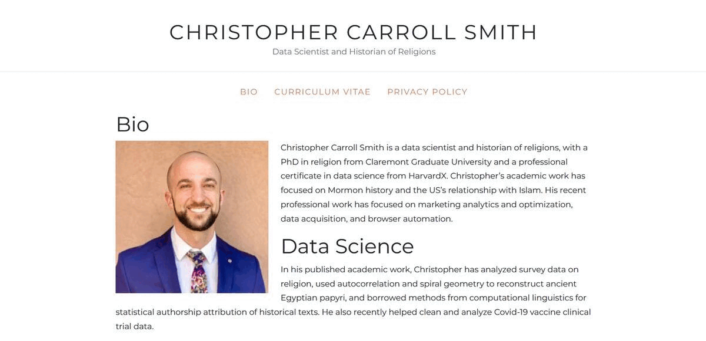

# Readme

This is a simple academic portfolio website I created for myself in 2019. It's a static site built with HTML, CSS, Bootstrap, and SCSS. I mostly don't use Bootstrap now because I find it a bit bloated, but it's a good way to get started with web development.

Use `npm install` to install the dependencies and `npm start` to start the server.

Theme is controlled from bootstrap.scss, and a few custom styles in custom.css. Other than that, it's all HTML.

Front page is shown here:

The site also includes a Curriculum Vitae page and a Privacy Policy page.